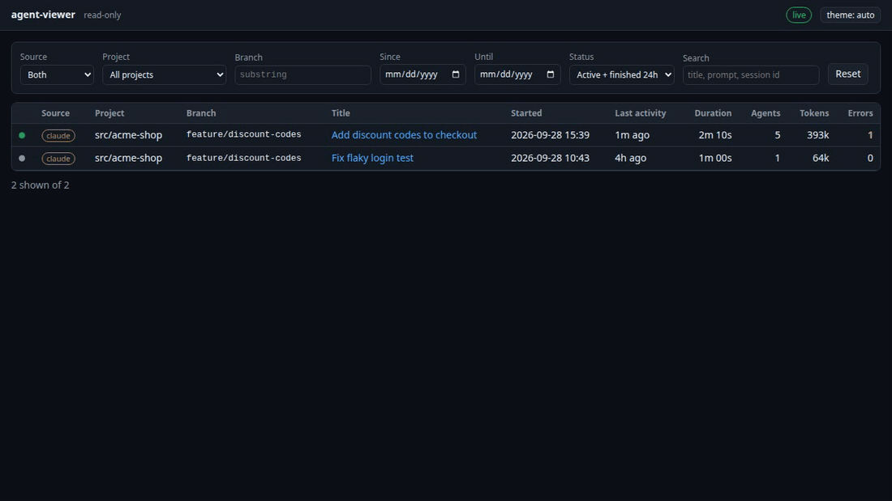

# agent-viewer

A local, read-only web viewer for AI coding agent sessions.
It reads the JSONL transcripts that [Claude Code](https://docs.anthropic.com/en/docs/claude-code) and Oh My Pi already write to disk and shows them live in your browser.



- **Sessions:** running and recent sessions from both tools, with filters for source, project, branch, date and status.
- **Agent tree:** main session, subagents and nested subagents, with their agent and session ids.
- **Timeline:** every prompt, assistant message, thinking block, tool call and result, and skill invocation, read-only.
- **Stats:** tokens (input, output, cache), models, tool calls with errors and durations, skills (invoked or preloaded), subagent types.
- **Graph canvas:** a pan and zoom view of the session with a card per agent, spawn, resume and continuation edges, and tool and skill nodes. Working agents and in-flight tool calls animate live. Click a card or a tool to open its timeline.

It never writes to, moves or deletes a transcript file.

## Requirements

- Python 3.9 or newer, standard library only.
- A modern browser.
- Node.js 18 or newer only to run the frontend tests.

## Run

```bash
python3 -m agent_viewer --open
```

The server listens on `127.0.0.1:8765` only.
Options:

| Option | Default | Meaning |
|---|---|---|
| `--port` | `8765` | Port; `0` picks a free one. |
| `--claude-root` | `~/.claude/projects` | Claude Code transcripts. |
| `--omp-root` | `~/.omp/agent/sessions` | Oh My Pi transcripts. |
| `--idle-window` | `30m` | How long a main session that finished its turn shows as `idle` before it counts as `finished`. |
| `--stale-after` | `10m` | How long a session can go quiet mid-turn before it shows as `stale`. |
| `--open` | off | Open the browser. |

## Test

```bash
python3 -m unittest discover -s tests       # backend, API, SSE, e2e smoke
node --test agent_viewer/static/tests/       # frontend pure modules
AGENT_VIEWER_PERF=1 python3 -m unittest discover -s tests -p 'test_*budget*.py'   # performance budgets
```

The browser test in `tests/e2e/test_ui_smoke.py` runs only when Playwright for Python is installed, and skips otherwise.

To work on the frontend without real transcripts, run the mock server, which serves the contract examples and replays a scripted live stream:

```bash
python3 contract/mock_server.py --port 8766
```

## Demo recording

The GIF above is recorded from synthetic transcripts of a made-up project, so it shows no real work.
To re-record it after a UI change (needs `google-chrome` and `ffmpeg`):

```bash
node demo/record.mjs            # writes docs/demo.gif
```

`demo/demo_data.py` builds the sessions and then appends the live part in real time while the recorder drives the browser.

## Design

- `SPEC.md` - data model, transcript formats, tree reconstruction, API and SSE contract.
- `docs/FEATURE-graph-canvas.md` - the graph canvas feature.
- `contract/examples/` - example JSON for every endpoint, shared by the tests and the mock server.

## Security

Transcripts can hold anything, so all of their content is treated as untrusted.
It is rendered as plain text only, never as HTML, under a strict Content Security Policy with no inline or third-party scripts.
The server accepts only `GET` and `HEAD`, only from `127.0.0.1`, and rejects foreign `Host` headers.

The transcript formats are undocumented and can change between tool versions.
Lines that fail to parse are skipped and counted, never fatal.

## License

[MIT](LICENSE)
